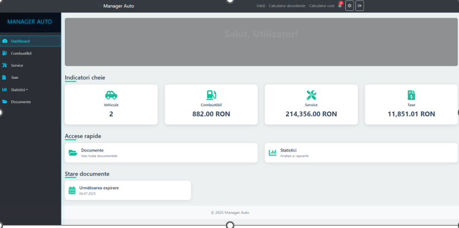
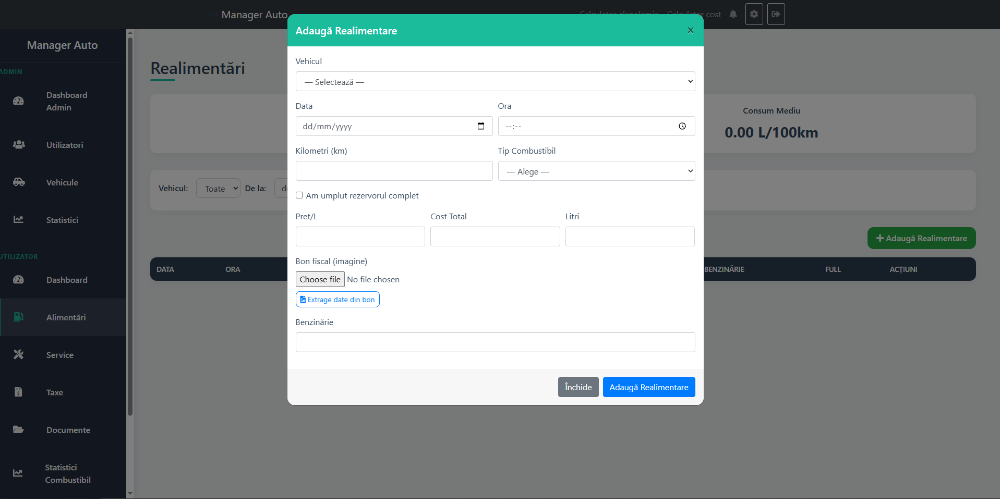
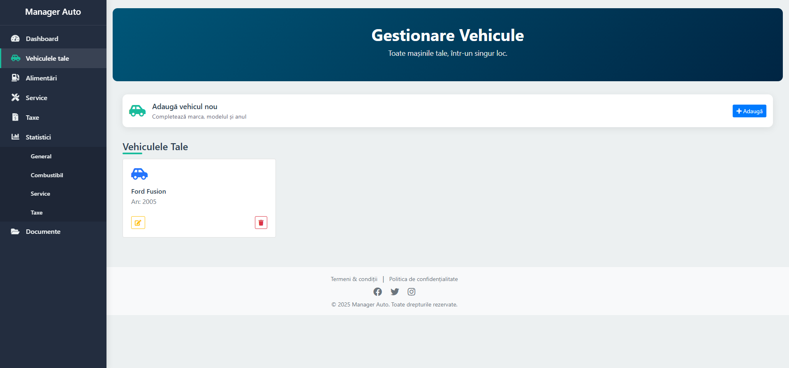
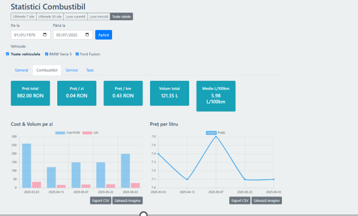

# Car Maintenance Web Application

## Overview
This is a web application designed to help users efficiently manage and maintain their vehicles. The application provides features for tracking fuel, expenses, service history, and important documents related to cars. It also offers visual statistics to monitor costs and fuel consumption over time.

## Features
- Add and manage cars in the system
- Record fuel purchases and other expenses
- Automatically populate data from receipts using OCR (optional feature)
- Store and manage important vehicle documents
- Access visual statistics and reports for expenses and fuel consumption
- Travel cost and distance calculator (based on budget)
- Blood alcohol content (BAC) calculator
- Simple and user-friendly interface

## Technologies Used
- **Backend:** PHP
- **Frontend:** HTML, CSS, JavaScript
- **Database:** MySQL
- **Server Environment:** XAMPP

  ## Installation
1. Install [XAMPP](https://www.apachefriends.org/index.html) and set up Apache and MySQL.
2. Copy the project folder to the `htdocs` directory.
3. Create a new database in phpMyAdmin and import the `db.sql` file from the `db/` folder.
4. Configure database credentials in `config.php`
5. Open the application in your browser: `http://localhost/Licenta`.

## License
This project is for educational purposes and portfolio demonstration.

## Screenshots

### Dashboard

*Overview of vehicles, recent expenses, and quick access to features.*

### Add Fuel / Expense

*Form to record fuel purchases*

### Vehicle Details

*Detailed information about a specific car*

### Statistics

*Visual charts showing fuel consumption and expenses over time.*

